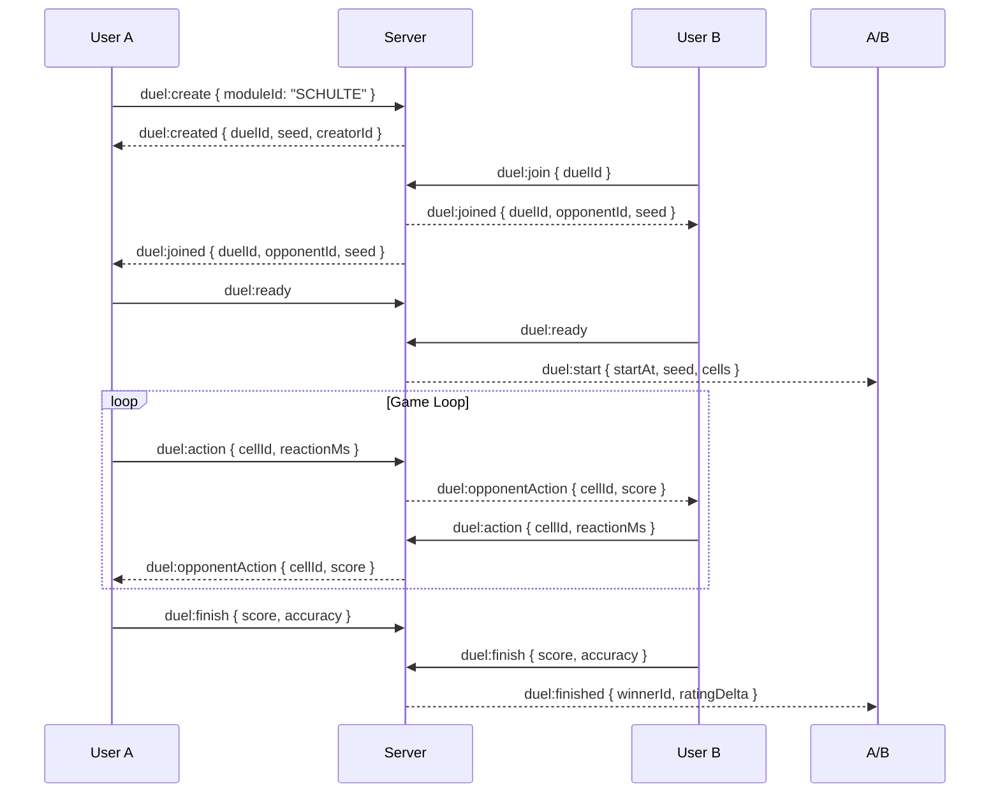

# Socket.io Protocol (Real-time)

**Порт**: 3006 (same as HTTP) · **Transport**: WebSocket + Polling fallback · **Auth**: JWT в handshake.auth

---

## Архитектура

```
┌─────────────────┐     ┌─────────────────┐     ┌─────────────────┐
│   Client A      │     │   Socket.io     │     │   Client B      │
│   (React)       │◄───►│   Server        │◄───►│   (React)       │
└─────────────────┘     │   (Express)     │     └─────────────────┘
                        └─────────────────┘
                                │
                        ┌───────┴───────┐
                        ▼               ▼
                   ┌─────────┐    ┌─────────┐
                   │ Redis   │    │ Prisma  │
                   │ Adapter │    │ (Postgres)│
                   └─────────┘    └─────────┘
```

### Rooms & Namespaces

| Namespace | Room Pattern | Участники | Назначение |
|---|---|---|---|
| `/` (default) | `duel:{duelId}` | 2 игрока | Real-time дуэль |
| `/` | `duel:{duelId}:spectators` | N наблюдателей | Смотрим дуэль |
| `/` | `user:{userId}` | 1 пользователь | Персональные уведомления |
| `/chat` | `symbolchat:{channel}` | N пользователей | SymbolChat лента |

---

## Authentication (Handshake)

```typescript
// Client
const socket = io('/chat', {
  auth: { token: localStorage.getItem('jwt') },
  transports: ['websocket', 'polling'],
});

// Server (src/server/socket/index.ts)
io.use(async (socket, next) => {
  const token = socket.handshake.auth?.token;
  if (!token) return next(new Error('Unauthorized'));

  try {
    const decoded = jwt.verify(token, JWT_SECRET);
    const user = await prisma.user.findUnique({ where: { id: decoded.id } });
    if (!user || !user.isActive) return next(new Error('User not found'));

    socket.data.user = user; // доступно в всех handlers
    next();
  } catch {
    next(new Error('Invalid token'));
  }
});
```

---

## Duels Namespace (`/`)

### Client → Server Events

| Event | Payload | Ответ (ack) | Описание |
|---|---|---|---|
| `duel:create` | `{ moduleId: string, config?: TrainerConfig }` | `{ duelId, seed, creatorId }` | Создать лобби |
| `duel:join` | `{ duelId: string }` | `{ seed, opponent, config }` | Присоединиться |
| `duel:ready` | — | `{ startAt: number }` | Готов к старту |
| `duel:action` | `{ cellId: number, reactionMs: number, t: number }` | `{ valid: boolean, score, nextCell? }` | Игровое действие |
| `duel:finish` | `{ score, accuracy, durationMs }` | `{ ratingDelta, newRating, winnerId }` | Завершить дуэль |
| `duel:rematch` | — | `{ newDuelId, newSeed }` | Реванш |
| `duel:leave` | — | `{ left: boolean }` | Покинуть лобби |

### Server → Client Events

| Event | Payload | Когда |
|---|---|---|
| `duel:created` | `{ duelId, creatorId, moduleId, config }` | После `duel:create` |
| `duel:joined` | `{ duelId, opponentId, seed, config }` | После `duel:join` |
| `duel:start` | `{ startAt, seed, cells[] }` | Когда оба ready |
| `duel:opponentAction` | `{ cellId, reactionMs, score, progress }` | Ход соперника |
| `duel:finished` | `{ winnerId, scores, ratingDelta, duration }` | Игра окончена |
| `duel:rematchOffered` | `{ fromUserId }` | Предложение реванша |
| `duel:cancelled` | `{ reason: 'left' | 'timeout' | 'error' }` | Отмена |

### Flow: Create → Join → Play



---

## SymbolChat Namespace (`/chat`)

### Client → Server

| Event | Payload | Ack |
|---|---|---|
| `chat:post` | `{ symbol: string, category: string, sessionId?: string }` | `{ postId, createdAt }` |
| `chat:react` | `{ postId: string, emoji: string }` | `{ reactions: Record<string, number> }` |
| `chat:feed` | `{ channel: 'global' | 'friends', cursor?: string, limit: number }` | `{ posts: Post[], nextCursor }` |
| `chat:subscribe` | `{ channel: string }` | `{ subscribed: true }` |
| `chat:unsubscribe` | `{ channel: string }` | `{ unsubscribed: true }` |

### Server → Client

| Event | Payload |
|---|---|
| `chat:newPost` | `{ post: Post, author: UserPreview }` |
| `chat:reactionUpdate` | `{ postId, reactions, userReacted }` |
| `chat:typing` | `{ userId, pseudonym }` (optional, debounced) |

---

## Validation & Anti-cheat (Duels)

### Seed-based Evidence Validation

```typescript
// Server-side (src/server/socket/duels.ts)
function validateAction(duel: Duel, action: DuelAction): boolean {
  // 1. Проверка членства
  if (duel.creatorId !== userId && duel.opponentId !== userId) return false;

  // 2. Проверка состояния
  if (duel.status !== 'playing') return false;

  // 3. Evidence-based: пересчёт ожидаемого результата по seed
  const expected = computeExpectedCell(duel.seed, action.cellIndex);
  if (expected !== action.cellId) return false; // читер или десинк

  // 4. Timing validation (server-authoritative)
  const serverNow = Date.now();
  const clientElapsed = action.t; // клиентское время от старта
  const serverElapsed = serverNow - duel.startedAt;
  if (Math.abs(clientElapsed - serverElapsed) > 500) return false; // >500ms drift

  return true;
}
```

### Suspicious Pattern Detection

```typescript
function detectSuspiciousPatterns(session: GameSession): SuspiciousFlags {
  const clicks = session.events.filter(e => e.type === 'cell_click');

  return {
    tooFast: clicks.some(c => c.reactionMs < 50),           // < 50ms
    perfectAccuracy: clicks.length > 10 && clicks.every(c => c.correct), // 100%
    inhumanRhythm: calculateEntropy(clicks.map(c => c.reactionMs)) < 0.3, // слишком регулярно
    superhuman: clicks.length > 100 && median(clicks.map(c => c.reactionMs)) < 80, // median < 80ms
  };
}
```

---

## Reconnection & State Sync

### Client Reconnection Logic

```typescript
// src/hooks/useDuelSocket.ts
socket.on('disconnect', (reason) => {
  if (reason === 'io server disconnect') return; // не переподключаемся самому

  // Экспоненциальный бэкофф: 1s, 2s, 4s, 8s, max 30s
  const delay = Math.min(1000 * 2 ** reconnectAttempts, 30000);
  setTimeout(() => socket.connect(), delay);
});

socket.on('connect', async () => {
  if (currentDuelId) {
    // Запрос актуального состояния
    socket.emit('duel:sync', { duelId: currentDuelId }, (state) => {
      if (state) {
        updateDuelState(state); // восстановление cells, scores, timer
      } else {
        // дуэль уже закончилась или не существует
        navigate('/duels');
      }
    });
  }
});
```

### Server Sync Handler

```typescript
socket.on('duel:sync', ({ duelId }, callback) => {
  const duel = await prisma.duel.findUnique({
    where: { id: duelId },
    include: { creator: true, opponent: true, actions: { orderBy: { t: 'asc' } } },
  });

  if (!duel) return callback(null);

  callback({
    status: duel.status,
    cells: duel.seed ? generateCells(duel.seed) : [],
    scores: { creator: duel.creatorScore, opponent: duel.opponentScore },
    currentTurn: duel.currentTurn,
    timeRemaining: duel.startedAt ? Math.max(0, duel.duration - (Date.now() - duel.startedAt)) : 0,
  });
});
```

---

## Error Codes (Ack Responses)

| Code | Message | Client Action |
|---|---|---|
| `UNAUTHORIZED` | Invalid or missing token | Redirect to login |
| `NOT_FOUND` | Duel/Post not found | Navigate away |
| `FORBIDDEN` | Not a participant | Show toast, leave room |
| `INVALID_ACTION` | Evidence validation failed | Ignore, request sync |
| `DUEL_ENDED` | Duel already finished | Navigate to results |
| `RATE_LIMITED` | Too many actions/sec | Throttle locally |
| `SERVER_ERROR` | Internal error | Retry with backoff |

---

## Rate Limits (Server-side)

| Event | Limit | Window |
|---|---|---|
| `duel:action` | 30/sec | Rolling 1s |
| `duel:create` | 5/min | Sliding |
| `chat:post` | 10/min | Sliding |
| `chat:react` | 50/min | Sliding |
| Handshake | 10/min/IP | Sliding |

---

## Testing (Vitest + Socket.io Client)

```typescript
// src/tests/duels-socket.test.ts
import { io, Socket } from 'socket.io-client';
import { createServer } from 'http';
import { Server } from 'socket.io';

describe('Duels Socket', () => {
  let httpServer: http.Server;
  let ioServer: Server;
  let clientA: Socket;
  let clientB: Socket;
  let duelId: string;

  beforeAll((done) => {
    httpServer = createServer();
    ioServer = new Server(httpServer);
    // ... attach duel handlers ...
    httpServer.listen(0, () => done());
  });

  afterAll(() => {
    ioServer.close();
    httpServer.close();
  });

  beforeEach((done) => {
    clientA = io(`http://localhost:${httpServer.address().port}`, { auth: { token: tokenA } });
    clientB = io(`http://localhost:${httpServer.address().port}`, { auth: { token: tokenB } });
    clientA.on('connect', () => clientB.on('connect', done));
  });

  afterEach(() => {
    clientA.disconnect();
    clientB.disconnect();
  });

  it('creates and joins duel', (done) => {
    clientA.emit('duel:create', { moduleId: 'SCHULTE' }, (resp) => {
      expect(resp.duelId).toBeDefined();
      duelId = resp.duelId;

      clientB.emit('duel:join', { duelId }, (joinResp) => {
        expect(joinResp.seed).toBe(resp.seed);
        done();
      });
    });
  });

  it('validates actions via seed', (done) => {
    // ... setup duel ...
    clientA.emit('duel:action', { cellId: 999, reactionMs: 100, t: 1000 }, (resp) => {
      expect(resp.valid).toBe(false);
      expect(resp.error).toBe('INVALID_ACTION');
      done();
    });
  });
});
```

---

## Мониторинг Socket.io

| Метрика | Источник | Alert |
|---|---|---|
| Connected sockets | `io.engine.clientsCount` | > 10000 → scale |
| Rooms count | `io.sockets.adapter.rooms.size` | — |
| Messages/sec | Custom counter | > 5000/s → investigate |
| Reconnection rate | `socket.on('reconnect')` | > 5%/min → issue |
| Handshake errors | `io.on('connection_error')` | > 1% → alert |

---

## Файлы

| Путь | Назначение |
|---|---|
| `src/server/socket/index.ts` | Entry point, auth middleware, namespaces |
| `src/server/socket/duels.ts` | Duels handlers, validation, anti-cheat |
| `src/server/socket/symbolchat.ts` | SymbolChat handlers |
| `src/server/socket/rooms.ts` | Room management, Redis adapter |
| `src/hooks/useDuelSocket.ts` | React hook для duels |
| `src/hooks/useSymbolChatSocket.ts` | React hook для chat |
| `src/tests/duels-socket.test.ts` | Integration tests (22 tests) |
| `src/tests/symbolchat-socket.test.ts` | Integration tests (14 tests) |
