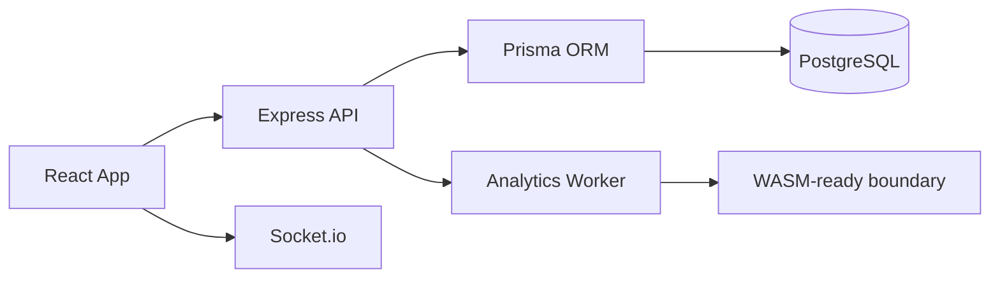

# Обзор проекта

**Когнитика** — приватная веб-платформа для когнитивных тренировок: тренажёры внимания, памяти, скорости реакции и адаптивная аналитика прогресса.

## Что это

- **30+ тренажёров** в 3 доменах: База (внимание/память), Инженерия (системное мышление), Страж Разума (критическое мышление)
- **Brain ID** — бесшовная аутентификация без паролей и email
- **Real-time дуэли** через Socket.io
- **Экспорт данных** в LLM-friendly JSON для персонального анализа
- **Android APK** собирается автоматически при каждом пуше в main

## Ключевые цифры

| Метрика | Значение |
|---|---|
| Тренажёров | 28 |
| Тесты | Vitest и Playwright; точный текущий результат подтверждает CI |
| Prisma моделей | 12 |
| CI/CD | GitHub Actions (lint → test → build → e2e → deploy) |
| Платформа | https://kognitika.ru |

## Тренажёры (прямые ссылки)

| Домен | Тренажёр | Ссылка |
|---|---|---|
| **База: Внимание** | Таблицы Шульте | https://kognitika.ru/schulte |
| | Таблица 1-90 (Горбов) | https://kognitika.ru/schulte-90 |
| | Эффект Струпа | https://kognitika.ru/stroop |
| | N‑Назад (Память) | https://kognitika.ru/nback |
| | Пространство | https://kognitika.ru/spatial |
| | Скоростная печать | https://kognitika.ru/typing |
| **База: Арифметика** | Быстрые вычисления | https://kognitika.ru/mental-math |
| | Таблица Алфавит | https://kognitika.ru/alphabet-table |
| | Струп + Алфавит | https://kognitika.ru/stroop-alphabet |
| | Экспресс-знания | https://kognitika.ru/express-knowledge |
| **Инженерия: Системное мышление** | Числовой анализ | https://kognitika.ru/numerical |
| | Системная логика | https://kognitika.ru/logical |
| | Архитектура контекста | https://kognitika.ru/topology |
| | Детектор коллизий | https://kognitika.ru/collision |
| | Асинхронный диспетчер | https://kognitika.ru/dispatcher |
| | Детектор аномалий | https://kognitika.ru/anomaly |
| | Объективный фильтр | https://kognitika.ru/objective |
| | Профилирование RICE | https://kognitika.ru/profiling |
| **Страж Разума: Критическое мышление** | Редукция шума | https://kognitika.ru/noise |
| | Смысловой сканер | https://kognitika.ru/scanner |
| | Декриптор | https://kognitika.ru/decryptor |
| | Верификация реальности | https://kognitika.ru/reality |
| | Hype Filter (Фактчек или Хайп) | https://kognitika.ru/hype |
| | Когнитивный фильтр | https://kognitika.ru/filter |
| | Рефрейминг (Фича, а не баг) | https://kognitika.ru/reframing |
| | Иммунитет к отказам | https://kognitika.ru/rejection |
| | Смысловые связи (Storytelling) | https://kognitika.ru/storytelling |
| | Глубокий фокус | https://kognitika.ru/focus |
| **Мета/Регуляция** | Нейрорегуляция: «Тишина» | https://kognitika.ru/silence |
| | Тест Люшера (барометр) | https://kognitika.ru/luscher |
| **Социальная когниция** | Ситуационный тест | https://kognitika.ru/situational |
| | Архитектура диалога | https://kognitika.ru/dialogue |

## Архитектура (упрощённо)

## Технологический стек

| Слой | Технологии |
|---|---|
| Frontend | React 19, Vite 7, TypeScript, Tailwind 4, Motion, Recharts |
| Backend | Express 4, Socket.io 4, Prisma 7, PostgreSQL 15+ |
| Аналитика | JS Web Worker, Rust/WASM-ready граница |
| Mobile | Capacitor 8 (Android APK в CI) |
| Тесты | Vitest и Playwright E2E; точный текущий результат подтверждает CI |
