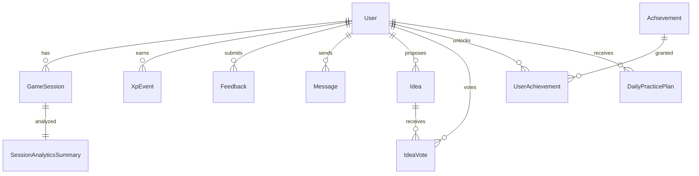

# Модели данных

Все 12 Prisma моделей с полями и описанием на русском.

---

## User

Основная модель пользователя. Brain ID-first идентичность.

| Поле | Тип | Описание |
|---|---|---|
| `id` | String @id @default(cuid()) | Уникальный идентификатор |
| `name` | String? | Отображаемое имя |
| `email` | String? @unique | Legacy/admin email (nullable) |
| `password` | String? | Legacy/admin хэш пароля (nullable) |
| `brainId` | String? @unique | Brain ID токен (уникальный) |
| `pseudonym` | String? | Псевдоним для лидербордов |
| `image` | String? | Аватар URL |
| `level` | Int @default(1) | Текущий уровень |
| `experience` | Int @default(0) | Накопленный XP |
| `rating` | Int @default(1000) | Рейтинг для дуэлей |
| `bonuses` | Int @default(0) | Бонусные баллы |
| `streakDays` | Int @default(0) | Дней подряд (streak) |
| `lastPlayedAt` | DateTime? | Последняя активность |
| `role` | String @default("USER") | Роль: USER / ADMIN |
| `createdAt` | DateTime @default(now()) | Дата регистрации |

**Отношения**: sessions (GameSession[]), achievements (UserAchievement[]), xpEvents (XpEvent[]), feedback (Feedback[]), messages (Message[]), ideas (Idea[]), ideaVotes (IdeaVote[])

**Индексы**: `brainId`, `pseudonym`, `experience` (desc)

---

## GameSession

Завершённая или активная тренировочная сессия.

| Поле | Тип | Описание |
|---|---|---|
| `id` | String @id @default(cuid()) | ID сессии |
| `userId` | String | FK → User |
| `gameType` | GameType (enum) | Тип тренажёра (24 варианта) |
| `score` | Int | Счёт / результат |
| `timeMs` | Int | Время в мс |
| `metadata` | Json? | Дополнительные данные (seed, mode, errors и т.д.) |
| `isCompleted` | Boolean @default(false) | Завершена ли |
| `createdAt` | DateTime @default(now()) | Время создания |

**Отношения**: user (User)

**Индексы**: `userId`, `createdAt`

**Enum GameType**: `SCHULTE`, `SCHULTE_GORBOV`, `N_BACK`, `STROOP`, `STROOP_ALPHABET`, `NUMERICAL`, `LOGICAL`, `SITUATIONAL`, `TYPING`, `SPATIAL`, `OBJECTIVE`, `PROFILING`, `ANOMALY`, `DIALOGUE`, `TOPOLOGY`, `COLLISION`, `DISPATCHER`, `NOISE`, `SCANNER`, `DECRYPTOR`, `REALITY`, `SILENCE`, `FILTER`, `HYPE`, `REFRAMING`, `REJECTION`, `STORYTELLING`, `FOCUS`, `MENTAL_MATH`, `ALPHABET_TABLE`, `LUSCHER`

---

## XpEvent

Событие начисления XP.

| Поле | Тип | Описание |
|---|---|---|
| `id` | String @id @default(cuid()) | ID события |
| `userId` | String | FK → User |
| `amount` | Int | Количество XP |
| `reason` | String | Причина (напр. "daily-task", "game-complete") |
| `createdAt` | DateTime @default(now()) | Время |

**Отношения**: user (User)

**Индексы**: `[userId, createdAt]`

---

## LeaderboardEntry

Снимок лидерборда (weekly/global).

| Поле | Тип | Описание |
|---|---|---|
| `id` | String @id @default(cuid()) | ID записи |
| `pseudonym` | String @unique | Псевдоним пользователя |
| `xp` | Int | XP на момент снимка |
| `rank` | Int | Ранг |
| `updatedAt` | DateTime @updatedAt | Время обновления |

---

## Feedback

Обратная связь от пользователя.

| Поле | Тип | Описание |
|---|---|---|
| `id` | String @id @default(cuid()) | ID |
| `userId` | String | FK → User |
| `type` | FeedbackType (enum) | `IDEA` / `BUG` / `IMPROVEMENT` / `OTHER` |
| `content` | String | Текст обращения |
| `trackingNum` | String @unique | Номер для отслеживания (напр. `FB-2026-001234`) |
| `status` | FeedbackStatus @default(OPEN) | `OPEN` / `IN_REVIEW` / `RESOLVED` |
| `createdAt` | DateTime @default(now()) | Время создания |

**Отношения**: user (User)

---

## Idea

Предложение/идея от пользователя.

| Поле | Тип | Описание |
|---|---|---|
| `id` | String @id @default(cuid()) | ID |
| `userId` | String | FK → User |
| `title` | String | Заголовок |
| `description` | String | Описание |
| `status` | IdeaStatus @default(OPEN) | `OPEN` / `IMPLEMENTED` / `REJECTED` |
| `createdAt` | DateTime @default(now()) | Время |

**Отношения**: user (User), votes (IdeaVote[])

---

## IdeaVote

Голос за идею (один пользователь — один голос на идею).

| Поле | Тип | Описание |
|---|---|---|
| `id` | String @id @default(cuid()) | ID |
| `userId` | String | FK → User |
| `ideaId` | String | FK → Idea |
| `createdAt` | DateTime @default(now()) | Время |

**Уникальный индекс**: `[userId, ideaId]`

**Отношения**: user (User), idea (Idea)

---

## Achievement

Достижение/ачивка.

| Поле | Тип | Описание |
|---|---|---|
| `id` | String @id @default(cuid()) | ID |
| `key` | String @unique | Машинный ключ (напр. `streak_7`) |
| `title` | String | Название |
| `description` | String | Описание |
| `icon` | String | Иконка (emoji или код) |
| `xpReward` | Int @default(0) | XP награда |
| `category` | String | Категория группировки |

**Отношения**: userAchievements (UserAchievement[])

---

## UserAchievement

Полученное пользователем достижение.

| Поле | Тип | Описание |
|---|---|---|
| `id` | String @id @default(cuid()) | ID |
| `userId` | String | FK → User |
| `achievementId` | String | FK → Achievement |
| `unlockedAt` | DateTime @default(now()) | Время получения |

**Уникальный индекс**: `[userId, achievementId]`

**Отношения**: user (User), achievement (Achievement)

---

## Message

Сообщение в SymbolChat / Cognitive Flow.

| Поле | Тип | Описание |
|---|---|---|
| `id` | String @id @default(cuid()) | ID |
| `userId` | String | FK → User |
| `content` | String | Текст/символы |
| `channel` | String | Канал чата |
| `createdAt` | DateTime @default(now()) | Время |

**Отношения**: user (User)

---

## SessionAnalyticsSummary

Предвычисленная аналитика сессии (для быстрых дашбордов).

| Поле | Тип | Описание |
|---|---|---|
| `id` | String @id @default(cuid()) | ID |
| `sessionId` | String @unique | FK → GameSession |
| `reactionTimeMs` | Int | Среднее время реакции |
| `accuracy` | Float | Точность (0–100) |
| `fatigueIndex` | Float | Индекс усталости |
| `engagementIndex` | Float | Индекс вовлечённости |
| `suspiciousPatternScore` | Float | Оценка подозрительных паттернов |
| `createdAt` | DateTime @default(now()) | Время |

**Отношения**: session (GameSession)

---

## DailyPracticePlan

Ежедневный план тренировок (адаптивный).

| Поле | Тип | Описание |
|---|---|---|
| `id` | String @id @default(cuid()) | ID |
| `userId` | String | FK → User |
| `date` | DateTime @db.Date | Дата плана |
| `items` | Json | Массив задач: `[{ moduleId, reason, rewardXp, completed }]` |
| `createdAt` | DateTime @default(now()) | Время создания |

**Уникальный индекс**: `[userId, date]`

**Отношения**: user (User)

---

## Enum'ы (summary)

| Enum | Значения |
|---|---|
| `GameType` | 28 значений (см. GameSession) |
| `FeedbackType` | `IDEA`, `BUG`, `IMPROVEMENT`, `OTHER` |
| `FeedbackStatus` | `OPEN`, `IN_REVIEW`, `RESOLVED` |
| `IdeaStatus` | `OPEN`, `IMPLEMENTED`, `REJECTED` |
| `UserRole` | `USER`, `ADMIN` |

---

## ER-диаграмма (упрощённо)

