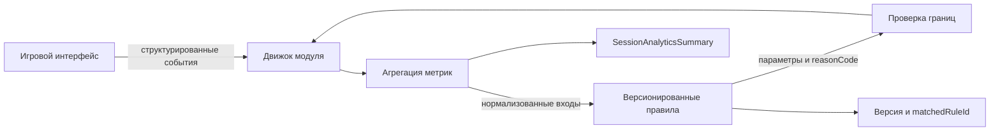

# Адаптивные правила и DMN

В Когнитике уже есть детерминированные правила адаптации и рекомендаций, но исполняемого DMN/BPMN-контура нет. Эта страница отделяет реализованную логику от возможного развития архитектуры и задаёт ограничения, без которых перенос правил в DMN не следует считать безопасным или научно обоснованным.

## Критическая оценка предложения

Идея представить правила в виде таблиц решений полезна для ревью, версионирования и объяснения результата. Однако DMN меняет форму хранения и исполнения правил, а не доказывает корректность порогов, пользу тренировки или диагностическую ценность метрик.

BPMN также не нужен только ради визуализации обычного React-сценария. Он оправдан, когда процесс становится долговременным и распределённым: появляются таймеры, повторные попытки, внешние сервисы, ручное согласование или восстановление после сбоя. Для локального цикла игры текущая модель состояния и EventBus проще.

ARIS или Camunda Modeler можно рассматривать как инструменты проектирования, но они не являются частью runtime. Их внедрение потребует владельца, оценки лицензирования, формата версионирования, CI-проверок и плана отката.

## Что реализовано сейчас

| Статус | Механизм | Реализация |
|---|---|---|
| `[implemented]` | События игрового движка | `src/core/events/event-bus.ts`, `src/core/events/event-schema.ts` |
| `[implemented]` | Расчёт стабильности и предложение сложности | `src/workers/analytics.worker.ts`, `src/hooks/useSchulteEngine.ts` |
| `[implemented]` | Рекомендация следующего модуля | `src/lib/practice-recommendations.ts` |
| `[implemented]` | Агрегированная аналитика с привязкой к владельцу | `src/core/analyze-session/session-analysis.ts`, `src/server/services/analytics-persistence.ts` |
| `[implemented]` | Одноразовая игровая попытка и защита от повторной выдачи XP | `src/server/services/game-attempt.ts`, `src/server/services/game-save.ts` |
| `[planned]` | Версионированные DMN-таблицы и decision service | В репозитории реализации нет |
| `[planned]` | BPMN-оркестрация сессии | В репозитории реализации нет |

Текущая адаптация Шульте является эвристикой в JavaScript worker, а не ИИ-моделью или DMN. После серии событий worker сравнивает разброс времени реакции с порогом `max(250, avgTime * 0.2)` и предлагает один из двух наборов параметров. Рекомендации после завершения используют фиксированные карты переходов и пороги точности в `src/lib/practice-recommendations.ts`.

Есть техническое расхождение, которое нужно устранить до формализации правил: worker предлагает `noise_level = 0.1`, а `src/hooks/useSchulteEngine.ts` включает цветовой шум только при значении больше `0.2`. Следовательно, этот выход worker сейчас не активирует заявленную модификацию.

## Где DMN может помочь

DMN имеет смысл использовать как управляемое представление уже согласованных правил:

- таблица хранится в репозитории и проходит code review;
- у каждого набора правил есть версия и дата вступления в силу;
- приоритеты строк и поведение при отсутствии совпадения однозначны;
- решение возвращает код причины, а не только новый уровень;
- результат можно воспроизвести по нормализованным входам и версии правил;
- предыдущая версия доступна для быстрого отката.

Предлагаемый безопасный контракт решения:

```text
Input:
  moduleId, roundSize, accuracy, p50ReactionMs,
  reactionStabilityMs, completedRounds, rulesVersion

Output:
  nextDifficulty, boundedParameters, reasonCode,
  matchedRuleId, rulesVersion
```

Вход не должен содержать токен, Brain ID, координаты кликов или иной сырой идентификатор. Точные события следует агрегировать до минимального набора метрик, необходимого для правила.

## Возможный поток



Это предложение расширяет существующий контур, а не заменяет защиту игровых попыток. Challenge в `src/server/services/game-attempt.ts` предотвращает повторное использование попытки, но не подтверждает истинность присланного клиентом времени или ошибок.

## Научные ограничения

Пример из исходного предложения с порогами «меньше 30 секунд» и «больше двух ошибок» нельзя переносить в production без проверки. На результат влияют размер сетки, устройство, задержка ввода, доступность интерфейса, знакомство с заданием, прерывания и компромисс между скоростью и точностью.

Метрики `fatigueIndex`, `engagementIndex`, стабильность и похожие показатели в текущей системе являются продуктовыми эвристиками. Они не должны описываться как диагноз или доказанная оценка когнитивного состояния.

До включения нового правила нужны:

1. заранее заданная гипотеза и основная метрика результата;
2. проверка граничных значений и конфликтующих строк таблицы;
3. учёт повторного прохождения и регрессии к среднему;
4. shadow-режим без влияния на пользователя;
5. ограниченный opt-in эксперимент с возможностью немедленного отката;
6. анализ роста ошибок, отказов от сессии и других нежелательных эффектов.

## Приватность, безопасность и продуктовые границы

- Решение должно выполняться только для владельца сессии, как и запросы в `src/server/services/analytics-persistence.ts`.
- Входы и выходы валидируются строгой схемой, числовые значения ограничиваются допустимыми диапазонами.
- Нужны rate limit, таймаут и детерминированный fallback на текущие правила.
- Журнал решения хранит версию правила и код причины, но не секреты и не сырую идентичность.
- Пользователь должен видеть, что сложность изменилась, и иметь возможность отключить адаптацию.
- Когнитивные показатели нельзя использовать для ограничения тарифа, навязывания покупки или иной дискриминационной монетизации.

## Когда статус можно изменить на implemented

DMN/BPMN-функция может быть обозначена как реализованная только когда в репозитории присутствуют:

- версионированная схема входа и выхода;
- сами правила и механизм их однозначного исполнения;
- тесты границ, приоритетов, fallback, приватности и воспроизводимости;
- аудит версии решения без персональных секретов;
- наблюдаемость, ответственный владелец и runbook отката;
- решение о паритете web и mobile;
- результаты проверки эффективности и безопасности, не подменяющие клиническую валидацию.

## Связанные страницы

- [Архитектура](../overview/architecture.md)
- [Научная методология](scientific-methodology.md)
- [Модели данных](../reference/data-models.md)
- [Безопасность](../security.md)

## Ключевые файлы

| Файл | Назначение |
|---|---|
| `src/workers/analytics.worker.ts` | Текущая эвристика анализа и предложения сложности |
| `src/hooks/useSchulteEngine.ts` | Применение предложения сложности в движке Шульте |
| `src/lib/practice-recommendations.ts` | Детерминированные рекомендации следующего модуля |
| `src/server/services/game-attempt.ts` | Одноразовые challenge для игровых попыток |
| `src/server/services/game-save.ts` | Атомарное сохранение результата и защита от повтора |
| `src/server/services/analytics-persistence.ts` | Валидация, владение и хранение агрегированной аналитики |
| `prisma/schema.prisma` | Модели игровых попыток, сессий и аналитических сводок |
